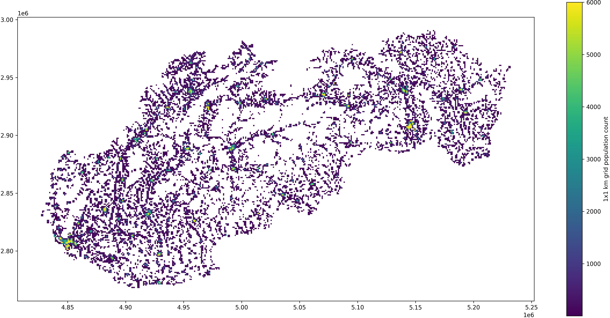

## Analyzing Slovakia's population count changes between 2006 and 2021 👪

#### Goal: 
to describe Slovakia's current (2021) population count and its changes between 2006 and 2021

#### Data:
- GEOSTAT (2006) and Eurostat Census Grid (2021) population data (1x1 km grid) available at: https://ec.europa.eu/eurostat/web/gisco/geodata/reference-data/population-distribution-demography/geostat

#### Research area: 
Slovakia, EU

#### Processing steps:
0. Importing packages
1. Scraping, downloading and unzipping data
2. Creating standardized population data for a single year
3. Filtering Slovakia's grids from all-EU data (only for 2006)
4. Performing a spatial join between all-EU data for 2021 and Slovakia's data for 2006 => merged dataset limited to Slovakia's grids
5. Finding 5 grids characterized by the highest population increase
6. Reprojecting population data to WGS84 (geographic coordinate system)
7. Calculating Slovakia's 2021 population count statistics

Prepared by: Aleksandra Radecka  
e-mail: aleksandraradecka@protonmail.com  
LinkedIn: https://www.linkedin.com/in/aleksandraradecka/
